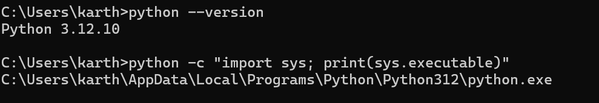
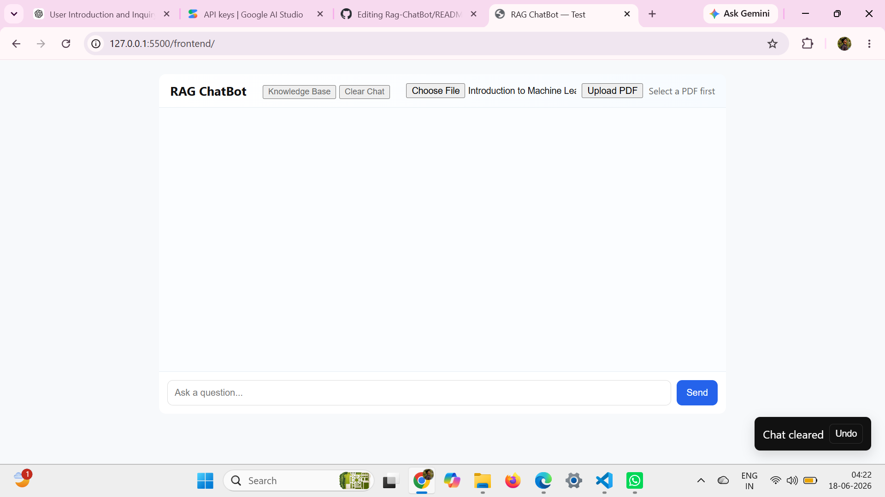
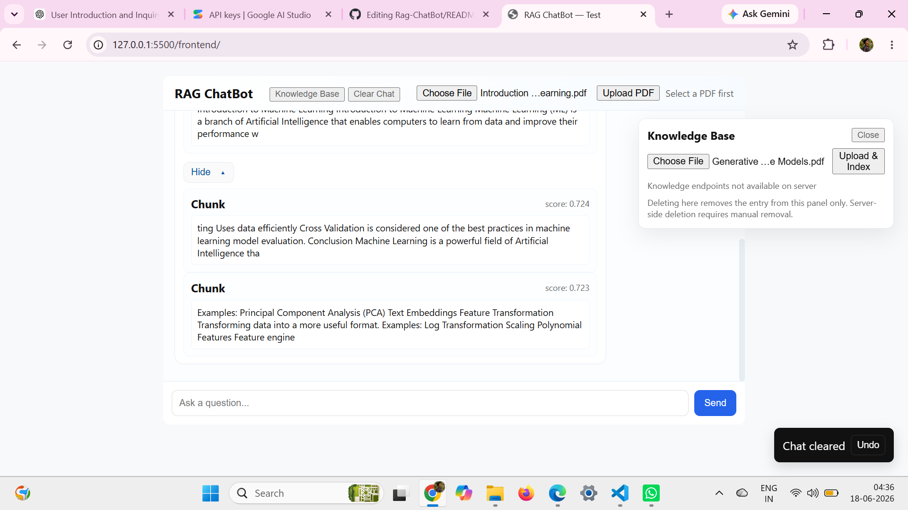
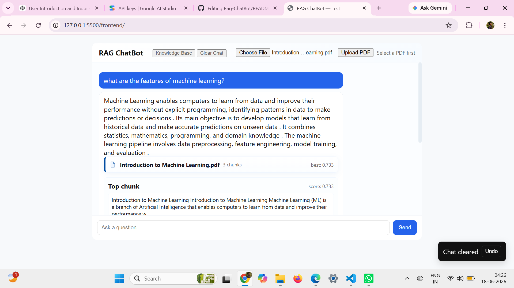

# RAG-CHATBOT

This repository contains a minimal scaffold for a Retrieval-Augmented Generation (RAG) chatbot.

Structure:

- `backend/`: FastAPI backend and ingestion scripts
- `frontend/`: Static UI files
- `venv/`: (placeholder) local virtual environment
 
 screenshorts:
    

Run the backend:

```bash
pip install -r backend/requirements.txt
uvicorn backend.app:app --reload
```
